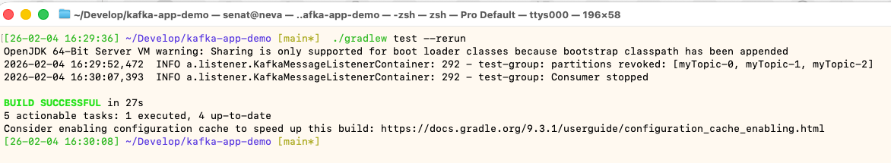

# Kafka Demo Application


**File**: `Docs/Preview1.png`
<div style="text-align: center;" >
  
</div>


Spring Boot 3.4 приложение с Apache Kafka, демонстрирующее Producer/Consumer паттерн.

## Требования

- Java 21+
- Docker Desktop (для Kafka)

## Быстрый старт

```bash
# Запуск приложения (автоматически поднимает Kafka через Docker Compose)
./gradlew bootRun

# Или сборка и запуск JAR
./gradlew bootJar
java -jar build/libs/kafka-demo-1.0.0-SNAPSHOT.jar
```

## Gradle команды

### Основные команды

| Команда | Описание |
|---------|----------|
| `./gradlew bootRun` | Запуск приложения с автостартом Docker Compose |
| `./gradlew build` | Полная сборка: компиляция + тесты + JAR |
| `./gradlew build -x test` | Сборка без тестов (быстрее) |
| `./gradlew test` | Запуск всех тестов |
| `./gradlew clean` | Удалить папку build/ |
| `./gradlew bootJar` | Собрать executable JAR |

### Полезные команды

| Команда | Описание |
|---------|----------|
| `./gradlew dependencies` | Дерево всех зависимостей |
| `./gradlew dependencies --configuration compileClasspath` | Только compile зависимости |
| `./gradlew dependencyUpdates` | Проверить обновления (нужен плагин) |
| `./gradlew tasks` | Список всех доступных задач |
| `./gradlew test --info` | Тесты с подробным выводом |
| `./gradlew test --rerun-tasks` | Принудительно перезапустить тесты |
| `./gradlew clean build` | Чистая сборка с нуля |

### Отладка

```bash
# Запуск с debug портом (5005)
./gradlew bootRun --debug-jvm

# Посмотреть что делает Gradle
./gradlew build --scan

# Verbose вывод
./gradlew build --info
./gradlew build --debug
```

## Gradle Wrapper

Проект использует Gradle Wrapper — не нужно устанавливать Gradle глобально.

- `./gradlew` — Unix/macOS
- `gradlew.bat` — Windows

Версия Gradle: 9.3.1 (определена в `gradle/wrapper/gradle-wrapper.properties`)

## API Endpoints

```bash
# Отправить сообщение в Kafka
curl -X POST http://localhost:8081/api/kafka \
  -H "Content-Type: application/json" \
  -d '{"field1":"hello","field2":"world"}'

# Health check
curl http://localhost:8081/api/kafka/health

# Spring Actuator
curl http://localhost:8081/actuator/health
```

## Порты

| Сервис | Порт | Описание |
|--------|------|----------|
| Application | 8081 | REST API |
| Kafka Broker | 9092 | Kafka протокол |
| Kafka UI | 8080 | Web интерфейс для Kafka |

## Структура проекта

```
kafka-app-demo/
├── build.gradle.kts          # Gradle build script (Kotlin DSL)
├── settings.gradle.kts       # Настройки проекта
├── gradle/
│   └── wrapper/
│       ├── gradle-wrapper.jar
│       └── gradle-wrapper.properties
├── gradlew                   # Gradle Wrapper (Unix)
├── gradlew.bat               # Gradle Wrapper (Windows)
├── compose.yaml              # Docker Compose (Kafka + UI)
└── src/
    ├── main/
    │   ├── java/             # Исходный код
    │   └── resources/
    │       └── application.properties
    └── test/
        ├── java/             # Тесты (Testcontainers)
        └── resources/
            └── docker-java.properties
```

## Сборка артефактов

После `./gradlew build`:

```
build/
├── classes/          # Скомпилированные классы
├── libs/
│   └── kafka-demo-1.0.0-SNAPSHOT.jar   # Executable JAR
├── reports/
│   └── tests/test/index.html           # HTML отчёт о тестах
└── test-results/     # XML результаты тестов
```

## Тестирование

Интеграционные тесты используют **Testcontainers** — автоматически поднимают Kafka в Docker.

```bash
# Запуск тестов
./gradlew test

# Открыть отчёт (macOS)
open build/reports/tests/test/index.html
```

Требования для тестов:
- Docker Desktop запущен
- Testcontainers 2.0.3+ (для Docker 29+)

## Технологии

| Компонент | Версия |
|-----------|--------|
| Spring Boot | 3.4.2 |
| Apache Kafka | 3.8.1 |
| Testcontainers | 2.0.3 |
| Gradle | 9.3.1 |
| Java | 21 |
| Lombok | 1.18.40 |

## Troubleshooting

### Docker не найден
```
Could not find a valid Docker environment
```
**Решение:** Запустить Docker Desktop и подождать пока запустится.

### Testcontainers не работает с Docker 29+
```
client version 1.32 is too old. Minimum supported API version is 1.44
```
**Решение:** Обновить Testcontainers до 2.0.3+

### Порт 8081 занят
```
Web server failed to start. Port 8081 was already in use.
```
**Решение:**
```bash
# Найти процесс
lsof -i :8081
# Убить процесс
kill -9 <PID>
```

### Gradle daemon проблемы
```bash
# Остановить все демоны
./gradlew --stop

# Запуск без демона
./gradlew build --no-daemon
```